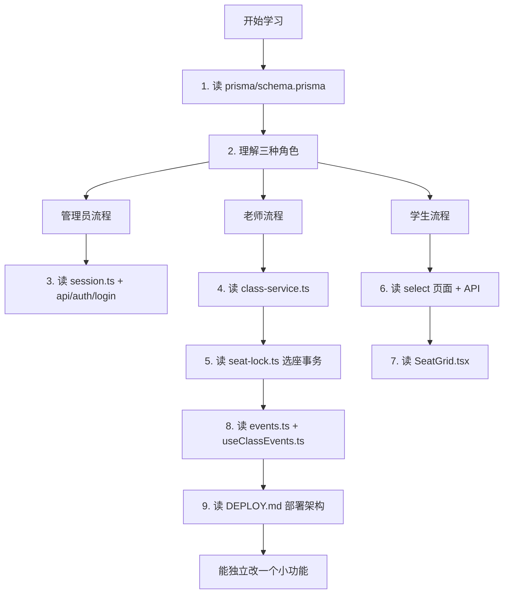
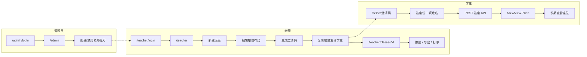
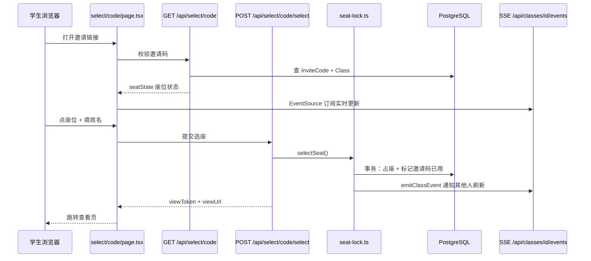
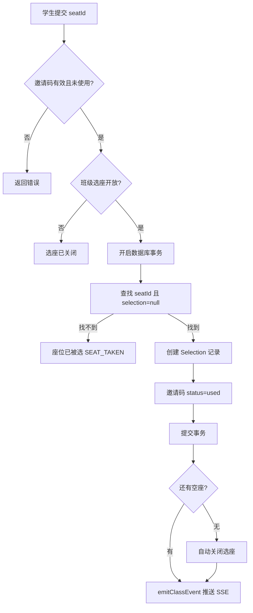
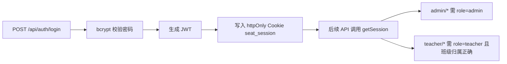
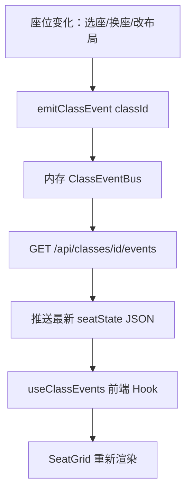

# 座位选择系统 · 学习指南

适合按「数据 → 后端 → 前端 → 实时同步」顺序阅读代码。

## 技术栈一览

| 层级 | 技术 | 作用 |
|------|------|------|
| 框架 | Next.js 16 App Router | 页面 + API 一体 |
| 语言 | TypeScript | 类型安全 |
| 样式 | Tailwind CSS | 界面样式 |
| 数据库 | PostgreSQL + Prisma | 存班级/座位/选座记录 |
| 认证 | JWT Cookie（jose） | 管理员/老师登录 |
| 实时 | SSE（Server-Sent Events） | 多人同时看座位变化 |

## 目录结构（先看这些）

```
prisma/schema.prisma          # 数据表设计（学习起点）
src/lib/
  seat-lock.ts                # 选座核心：防抢座、事务
  class-service.ts            # 班级/座位 CRUD、座位状态聚合
  session.ts                  # 登录 Session（JWT Cookie）
  events.ts                   # 内存事件总线（触发 SSE 推送）
  codes.ts                    # 邀请码、查看链接生成
src/app/
  page.tsx                    # 首页入口
  admin/                      # 管理员：创建老师
  teacher/                    # 老师：班级、邀请码、换座
  select/[code]/              # 学生：凭邀请码选座
  view/[token]/               # 学生：查看自己的座位
  api/                        # 所有后端接口
src/components/
  SeatGrid.tsx                # 座位网格 UI（共用）
src/hooks/
  useClassEvents.ts           # 前端订阅 SSE，刷新座位图
```

---

## 学习路线图



---

## 角色与页面流程



---

## 数据表关系

```mermaid
erDiagram
  Teacher ||--o{ Class : owns
  Class ||--o{ Seat : has
  Class ||--o{ InviteCode : issues
  Class ||--o{ Selection : records
  Seat ||--o| Selection : "最多一人"
  InviteCode ||--o| Selection : "一码一座"
  Selection }o--|| Seat : occupies
```

**关键约束（防 bug 的重点）：**

- `Seat` 与 `Selection` 一对一：一个座位最多一个学生
- `InviteCode` 与 `Selection` 一对一：一个邀请码只能用一次
- `viewToken`：学生无需登录，凭 token 永久查看座位

---

## 学生选座完整流程（最重要）



---

## 防抢座：事务怎么工作



核心代码在 [`src/lib/seat-lock.ts`](src/lib/seat-lock.ts) 的 `selectSeat()`。

---

## 登录与权限



学生端**不需要登录**，只靠 `邀请码` 和 `viewToken`。

---

## 实时同步（SSE）



注意：事件总线在**单进程内存**中。Vercel 多实例时，实时性可能略差，但数据库仍是权威来源，不会重复占座。

---

## 建议学习顺序（约 2～3 天）

| 天数 | 任务 | 阅读文件 |
|------|------|----------|
| 第 1 天 | 搞懂数据模型和角色 | `schema.prisma` → `page.tsx` → `session.ts` |
| 第 2 天 | 搞懂选座核心 | `seat-lock.ts` → `select/[code]/` → `SeatGrid.tsx` |
| 第 3 天 | 搞懂老师端和实时 | `class-service.ts` → `teacher/classes/[id]/` → `useClassEvents.ts` |

## 小练习（巩固用）

1. 在老师端邀请码列表加「未使用数量」统计
2. 选座成功页显示「X 排 X 列」而不只是链接
3. 给 `SeatGrid` 空座位加长按提示
4. 阅读 `export.ts`，理解 Excel 导出流程

## 本地运行

```bash
cp .env.example .env   # 配置 DATABASE_URL
npm install
npx prisma migrate dev
npm run db:seed
npm run dev
```

默认管理员：`admin` / `admin123`（见 `prisma/seed.ts`）
